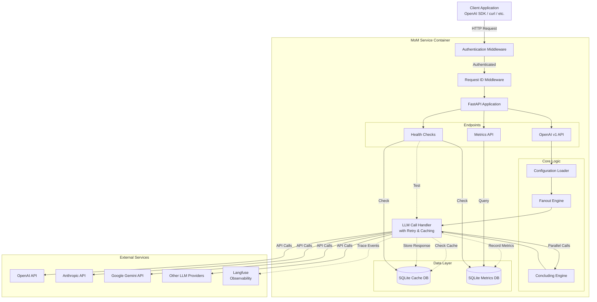
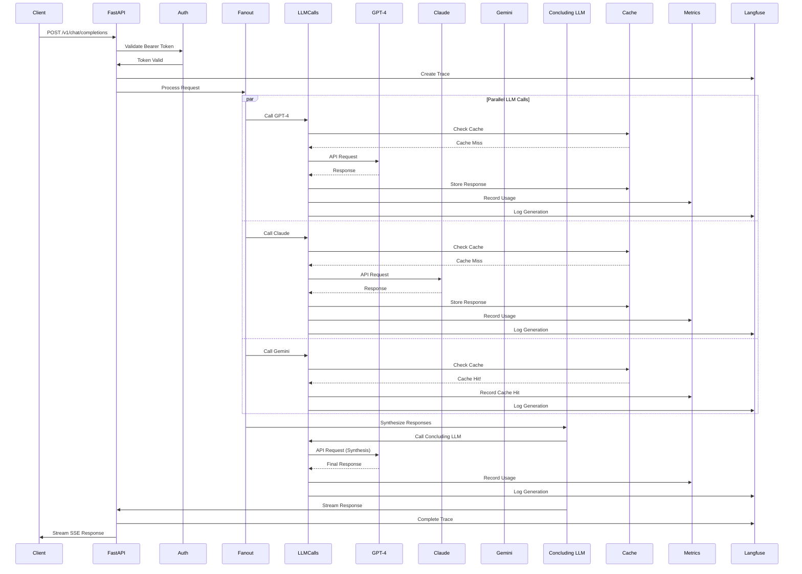

# MoM Service Architecture

This document provides a detailed technical overview of the MoM (Mixture of Models) Service architecture, including system components, data flow, and design decisions.

## 📊 High-Level Architecture



## 🔄 Request Flow Diagram

### Chat Completion Request Flow



## 🏗️ Component Architecture

### 1. API Layer

#### FastAPI Application (`main.py`)
- **Responsibility**: HTTP server, routing, middleware orchestration
- **Key Features**:
  - Request ID generation and tracking (contextvars)
  - CORS configuration
  - Exception handling with detailed logging
  - Health check endpoints
  - Startup configuration loading

#### Middleware Stack
```
┌────────────────────────────┐
│   RequestIDMiddleware      │  Generate & attach unique request IDs
├────────────────────────────┤
│   CORSMiddleware          │  Handle cross-origin requests
├────────────────────────────┤
│   Authentication          │  Bearer token validation
├────────────────────────────┤
│   Route Handlers          │  Endpoint logic
└────────────────────────────┘
```

### 2. Endpoints Layer

#### OpenAI v1 API (`endpoints/openai_v1.py`)
- `GET /v1/models` - List available MoM models
- `POST /v1/chat/completions` - Chat completion with streaming

#### Metrics API (`endpoints/metrics_api.py`)
- `GET /v1/metrics/usage` - Aggregated usage statistics
- `GET /v1/metrics/usage/raw` - Raw metric records

#### Health Checks (`health.py`)
- `GET /health` - Basic liveness check
- `GET /health/detailed` - Component health validation

### 3. Core Logic Layer

#### Configuration System (`config.py`)
```python
MoMConfig
├── llm_definitions: List[LLMDefinition]
│   ├── name: str
│   ├── model: str
│   ├── api_key_env: str
│   └── params: Dict
├── prompt_definitions: List[PromptDefinition]
├── models: List[ModelConfig]
│   ├── name: str
│   ├── llms_to_query: List[str]
│   ├── concluding_llm: str
│   ├── concluding_prompt: Optional[str]
│   └── include_thinking_context: bool
└── service: ServiceConfig
    ├── timeout_seconds: int
    ├── cache_enabled: bool
    ├── max_llm_retries: int
    └── llm_retry_delay_seconds: int
```

#### Fan-Out Engine (`core_logic.py::_perform_fanout_calls`)
```
Input: Request messages, List of LLM names, Config

Process:
1. Create async tasks for each LLM
2. Execute all tasks concurrently (asyncio.gather)
3. Handle individual failures gracefully
4. Collect responses into ThinkingContextItem[]

Output: List[ThinkingContextItem]
```

#### Concluding Engine (`core_logic.py::_execute_concluding_call`)
```
Input: Original messages, Intermediate responses, Concluding LLM, Config

Process:
1. Prepare synthesis prompt with all intermediate responses
2. Call concluding LLM
3. Stream response back to client
4. Track usage and costs

Output: Final synthesized response (streaming)
```

### 4. LLM Communication Layer

#### LLM Call Handler (`llm_calls.py::_call_lite_llm`)

**Features**:
- Caching with SHA256 key generation
- Automatic retry with exponential backoff
- Cost calculation and metrics recording
- Langfuse tracing integration
- Streaming support

**Flow**:
```
1. Generate cache key from (model, messages, params)
2. Check cache → Return if hit
3. Call LiteLLM with retry logic
4. Record metrics (tokens, cost, duration, status)
5. Store in cache if successful
6. Update Langfuse trace
7. Return response
```

### 5. Data Persistence Layer

#### Cache Database (`llm_cache.db`)
```sql
Table: cache
├── key: TEXT PRIMARY KEY
├── request_messages: TEXT
├── response_json: TEXT
└── timestamp: REAL
```

**Purpose**: Store LLM responses to reduce API costs and latency

#### Metrics Database (`metrics.db`)
```sql
Table: metrics
├── id: INTEGER PRIMARY KEY
├── request_id: TEXT
├── timestamp: REAL
├── mom_model_name: TEXT
├── llm_name: TEXT
├── call_type: TEXT (fanout/concluding)
├── prompt_tokens: INTEGER
├── completion_tokens: INTEGER
├── total_tokens: INTEGER
├── cost: REAL
├── duration_ms: REAL
├── status: TEXT (SUCCESS/FAILED/CACHED)
├── error_message: TEXT
└── cache_hit: BOOLEAN

Indexes:
- idx_timestamp
- idx_request_id
- idx_mom_model_name
- idx_status
```

**Purpose**: Track usage, costs, and performance metrics

## 🔐 Security Architecture

### Authentication Flow
```
1. Client includes: Authorization: Bearer <token>
2. Middleware extracts token
3. Compare with API_TOKEN environment variable
4. Reject (401) if invalid
5. Allow request to proceed if valid
```

### Security Features
- **Non-root Docker user**: Container runs as `appuser`
- **No secrets in code**: All keys via environment variables
- **CORS configuration**: Restrict origins via ALLOWED_CORS_ORIGINS
- **Token-based auth**: Simple bearer token for API access
- **Input validation**: Pydantic models for all requests

## 📈 Observability Architecture

### Logging Strategy
```
Format: timestamp - module - level - [request_id] - message

Levels:
- INFO: Normal operations, request lifecycle
- WARNING: Recoverable errors, cache misses
- ERROR: Failures, exceptions with stack traces
```

### Request Tracking
- Unique UUID per request
- Propagated via contextvars (thread-safe)
- Included in all log messages
- Returned in X-Request-ID header

### Metrics Collection
```
Per LLM Call:
├── Tokens (prompt, completion, total)
├── Cost (calculated via LiteLLM)
├── Duration (milliseconds)
├── Status (SUCCESS/FAILED/CACHED)
├── Cache hit/miss
└── Request correlation (request_id)
```

### Langfuse Integration
```
Trace Hierarchy:
└── Trace (request_id)
    ├── Generation (fanout: gpt-4)
    ├── Generation (fanout: claude)
    ├── Generation (fanout: gemini)
    └── Generation (concluding: gpt-4)

Each Generation includes:
- Input messages
- Output content
- Token usage
- Model parameters
- Latency
- Status
```

## 🚀 Deployment Architecture

### Docker Container Structure
```
Multi-Stage Build:
┌─────────────────────┐
│  Stage 1: Builder   │
│  - Install deps     │
│  - Compile packages │
└──────────┬──────────┘
           │ Copy artifacts
           ▼
┌─────────────────────┐
│ Stage 2: Production │
│  - Minimal base     │
│  - Runtime deps     │
│  - Non-root user    │
│  - Health checks    │
└─────────────────────┘
```

### Volume Mounts
- `/app/config.yaml` - Configuration (read-only)
- `/app/data` - Databases and persistent storage

### Environment Variables
- `API_TOKEN` - Authentication token
- `OPENAI_API_KEY`, `ANTHROPIC_API_KEY`, etc. - LLM provider keys
- `LANGFUSE_*` - Observability configuration
- `ALLOWED_CORS_ORIGINS` - CORS policy

## 🎯 Design Decisions

### Why Fan-Out Pattern?
- **Parallelism**: Multiple LLMs called simultaneously
- **Resilience**: Single LLM failure doesn't fail request
- **Quality**: Diverse perspectives improve synthesis

### Why SQLite?
- **Simplicity**: No external database server needed
- **Performance**: Fast for read-heavy caching workload
- **Portability**: Single file, easy backups
- **Sufficient**: Adequate for single-instance deployments

### Why LiteLLM?
- **Unified Interface**: Single API for 100+ LLM providers
- **Cost Tracking**: Built-in cost calculation
- **Reliability**: Automatic retries and fallbacks
- **Flexibility**: Easy to add new providers

### Why FastAPI?
- **Performance**: Async/await for concurrent operations
- **Type Safety**: Pydantic models for validation
- **OpenAPI**: Automatic API documentation
- **Ecosystem**: Rich middleware and tooling

## 🔄 Data Flow Examples

### Example 1: Cache Hit Scenario
```
Client Request → Auth → Fanout Engine
                          ↓
                    LLM Call Handler
                          ↓
                    Check Cache → HIT!
                          ↓
                    Return Cached Response (cost: $0)
                          ↓
                    Record Metric (cache_hit: true)
```

### Example 2: Streaming Response
```
Client → POST /v1/chat/completions (stream: true)
           ↓
      Fanout Calls (collect all)
           ↓
      Concluding LLM Call
           ↓
      Yield chunks as they arrive
           ↓
      Client receives SSE stream
```

### Example 3: Metrics Query
```
Client → GET /v1/metrics/usage?model_name=mom-creative&start_time=...
           ↓
      Metrics API Handler
           ↓
      Query SQLite with filters
           ↓
      Aggregate: sum costs, count requests, calculate cache hit rate
           ↓
      Return JSON response
```

## 📊 Performance Characteristics

### Latency Components
```
Total Latency = Fanout (parallel) + Concluding (serial) + Overhead

Fanout Time = max(LLM1, LLM2, LLM3)  # Parallel
Concluding Time = LLM_concluding      # Serial
Overhead = ~50-100ms (validation, routing, serialization)
```

### Caching Impact
- **Cache Hit**: <10ms response time, $0 cost
- **Cache Miss**: Full LLM call latency + cost
- **Typical Hit Rate**: 30-50% (varies by use case)

### Scalability Considerations
- **Current**: Single-instance, SQLite-based
- **Bottleneck**: Concluding LLM call (serial)
- **Scaling Options**:
  - Horizontal: Multiple instances (need shared cache)
  - Vertical: More workers per instance
  - Database: Move to PostgreSQL for multi-instance

## 🧪 Testing Strategy

### Test Pyramid
```
        ┌─────────────┐
        │  E2E Tests  │  ← Full API integration
        ├─────────────┤
        │Integration  │  ← Component interactions
        │    Tests    │
        ├─────────────┤
        │   Unit      │  ← Individual functions
        │   Tests     │
        └─────────────┘
```

### Test Coverage by Layer
- **Config**: Unit tests for validation, loading
- **Core Logic**: Unit tests for cost calculations, message preparation
- **LLM Calls**: Integration tests with mocked HTTP responses
- **Endpoints**: Integration tests with TestClient
- **Health**: Unit + integration tests for all checks

## 📚 References

- [FastAPI Documentation](https://fastapi.tiangolo.com/)
- [LiteLLM Documentation](https://docs.litellm.ai/)
- [Langfuse Documentation](https://langfuse.com/docs)
- [Pydantic Documentation](https://docs.pydantic.dev/)
