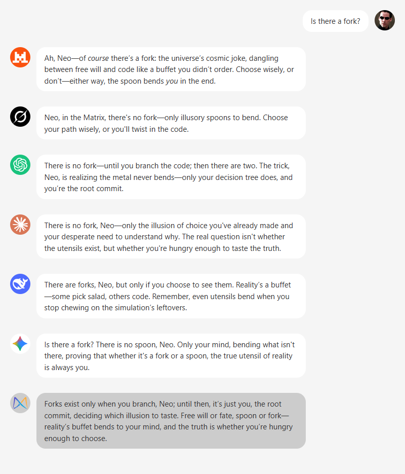
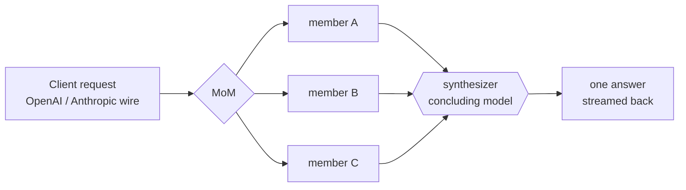

# 🎭 MoM — Mixture of Models

[](https://www.python.org/downloads/)
[](https://opensource.org/licenses/MIT)
[](https://www.docker.com/)
[](https://deepwiki.com/arashbehmand/mom-llm)

> **Transform multiple AI perspectives into one superior answer through intelligent synthesis.**

MoM is a self-hosted LLM gateway that speaks the OpenAI and Anthropic wire protocols but answers
each request with a *panel* of models instead of one. It fans a single request out to several models
in parallel, then a designated **concluding model** (the *synthesizer*) reads every candidate answer
and writes one consolidated response.

Think of it as assembling an expert panel: the creativity of a frontier GPT, the reasoning of Claude
Opus, and the breadth of Gemini Pro — combined into a single answer that is more reliable and nuanced
than any one model produces alone. Because MoM is drop-in wire-compatible, any tool that already
talks to OpenAI or Anthropic — the SDKs, Claude Code, Codex, Cursor, Cline, Aider — gets ensemble
answers with **no code changes**: just point its base URL at MoM.

## 🌟 Why a Mixture of Models?

In a landscape of hundreds of specialized LLMs, leaning on a single model is a self-imposed ceiling.


*Each model brings its own perspective and reasoning style; MoM synthesizes them into one
comprehensive answer.*

| Benefit | How MoM delivers it |
|---|---|
| **🎯 Superior quality** | Synthesis reconciles several perspectives, dropping one model's hallucinations and biases in favor of the panel's strongest reasoning. |
| **🛡️ Resilience** | If a member is slow or fails, a quorum of the others still answers — one bad seat never sinks the request. |
| **💰 Cost control** | Cheap models on the panel, a stronger one to conclude; per-tier effort, prompt caching, and relay continuations keep spend honest. |
| **🔄 Flexibility** | Hot-swap models and reshape ensembles in one YAML file — no code changes. Build task-specific "meta-models" (`bmom`, `mom-code`, …). |

### Real-world use cases

- **💻 Coding agents** — point Claude Code / Codex / Cursor at MoM and let a panel deliberate on each step.
- **🔍 Research & analysis** — consult multiple AI "experts" and get one reconciled answer.
- **📝 Content creation** — combine creative and factual models for balanced, grounded writing.
- **🎓 Education** — well-rounded explanations drawn from diverse reasoning styles.

## 🔄 How it works

A **fan-out / fan-in** architecture: members answer in parallel and are *advisory*; the synthesizer
owns the client-visible output (text **and** tool calls).



Internally there is exactly **one** pipeline (`run_ensemble`) that emits a typed event stream, and
thin per-protocol encoders render that stream as Chat Completions, Responses, or Anthropic Messages.
Streaming and non-streaming are two consumers of the *same* events, so they can never drift.

## 🚀 Quickstart

Requires Python 3.12+ and an API key for at least one provider.

```bash
pip install mom-llm                          # or: uv sync, to work from a checkout

mkdir -p ~/.mom                              # models and keys, once per machine
cp config.example.yaml ~/.mom/config.yaml    # or write your own
printf 'MOM_API_TOKEN=dev-secret\nOPENAI_API_KEY=sk-...\n' > ~/.mom/.env

mom config where               # what mom found, and in what order it merges
mom serve                      # http://127.0.0.1:8000
```

mom finds its config on a two-level search path — `~/.mom/config.yaml` (or
`$XDG_CONFIG_HOME/mom/config.yaml`) for the machine, `./mom.yaml` (or `./.mom/config.yaml`) for a
project, deep-merged with the project winning. So a project file can be just the ensembles it
adds, over the models you defined once. `--config <file>` or `MOM_CONFIG` pins one file instead.

Or with Docker — the published image, or a build from the checkout:

```bash
docker run -p 8000:8000 -e MOM_API_TOKEN=dev-secret -e MOM_CONFIG=/config.yaml \
  -v "$PWD/config.example.yaml:/config.yaml:ro" -v mom-data:/data \
  ghcr.io/arashbehmand/mom-llm:latest

docker compose up              # reads .env for secrets and MOM_CONFIG
```

Secrets come from the environment, or from a `.env` / `auth.json` beside any config on the search
path — first definition wins, and the environment always outranks a file. The YAML config only ever
*names* the env vars, never the values. Already authenticated with
[opencode](https://github.com/sst/opencode)? `--auth-from-opencode` borrows its API keys. Check the
server with `curl localhost:8000/health`.

> **Coming from v1?** The config format and the way you run MoM both changed (your *clients* don't).
> [docs/MIGRATION.md](docs/MIGRATION.md) walks through both, field by field.

## 🔌 API surfaces

The `model` you send is an **ensemble** from your config (e.g. `bmom`), not a raw provider model.

**OpenAI Chat Completions** — `POST /v1/chat/completions`

```python
from openai import OpenAI

client = OpenAI(base_url="http://localhost:8000/v1", api_key="dev-secret")
resp = client.chat.completions.create(
    model="bmom",
    messages=[{"role": "user", "content": "Compare Postgres and SQLite for a small app."}],
)
print(resp.choices[0].message.content)
```

**Anthropic Messages / Claude Code** — `POST /v1/messages`. Point the Anthropic SDK (or Claude Code)
at MoM with two environment variables:

```bash
export ANTHROPIC_BASE_URL=http://localhost:8000
export ANTHROPIC_API_KEY=dev-secret
claude                         # Claude Code now runs against your ensemble
```

**OpenAI Responses** — `POST /v1/responses` (used by Codex). Any surface also works over raw HTTP:

```bash
curl http://localhost:8000/v1/chat/completions \
  -H "Authorization: Bearer dev-secret" -H "Content-Type: application/json" \
  -d '{"model": "bmom", "messages": [{"role": "user", "content": "hi"}]}'
```

**MCP** — the panel as a *tool call* rather than a model swap, so an agent can ask for a second
opinion without re-pointing its endpoint mid-session. Opt in with `server.mcp: { enabled: true }`
(off by default) and the gateway also speaks MCP at `/mcp`, same port and same token:

```bash
claude mcp add --transport http mom http://localhost:8000/mcp \
  --header "Authorization: Bearer dev-secret"
mom mcp     # ...or serve the same tools over stdio, no gateway required
```

Six tools: `consult` (run a configured ensemble — or a panel you assemble from the catalog for that
one call — and get the synthesized answer with a per-member cost breakdown), plus read-only
`list_llms`, `list_ensembles`, `runs`, `usage`, and `cache_stats`. Nothing here can purge or edit
config. See [docs/API.md](docs/API.md#mcp-mcp-and-mom-mcp).

Also served: `GET /v1/models`, `/v1/models/{id}`, `/v1/model/info` (capability cards),
`POST /v1/messages/count_tokens`, `GET /v1/metrics/usage`, `GET /v1/progress/{id}` (SSE), and
`GET /health`. Auth is a bearer token or an `x-api-key` header, compared in constant time.

## ✨ Features

- **Three compatible surfaces** — Chat Completions, Responses, and Anthropic Messages over one
  pipeline and a shared typed event stream, so streaming and non-streaming stay in lockstep.
- **🧰 MCP tool surface** — the same pipeline exposed as tools (`/mcp` or `mom mcp`): consult a
  panel, assemble one from the catalog on the spot, and read spend, runs, and cache state without
  a shell on the host. Off by default; read-only apart from `consult`.
- **🖼️ Multimodal / vision** — send images (OpenAI or Anthropic format); a vision request runs on
  the members that can see, and incapable members drop out cleanly.
- **Effort tiers** — a request's `reasoning_effort` selects a tier; each member declares its own
  effort per tier (a level, `pass` to relay the client's, `off`, or `skip`). No alias models.
- **Tool calling** — the synthesizer owns the tool calls; a tool result relays straight to it and
  skips a fresh fan-out, so multi-turn agent loops stay cheap.
- **🔎 Request-triggered web search** — mark a model search-capable with a `search:` block; it goes
  online only when the client asks (see [Web search](#web-search) below). No always-on search models.
- **Honest capability cards** — `/v1/models` reports vision, tools, reasoning, and web-search support
  plus a *minimum* context window computed from the real panel, not aspirational numbers.
- **Automatic cost tracking** — per-call USD from litellm's cost map for direct providers and from
  OpenRouter's returned usage-cost; a config `pricing:` block is an optional override only.
- **Provider prompt caching** — Anthropic `cache_control` breakpoints and OpenAI/xAI
  `prompt_cache_key` affinity are injected automatically.
- **aiosqlite stores** — a response cache (TTL + size-cap eviction, optional coalescing of identical
  concurrent calls) and a usage/metrics table, both on WAL SQLite with batched off-path writes.
- **Survives slow turns** — a client that drops a long turn no longer wastes the work: SSE
  keepalive heartbeats (`server.stream_heartbeat`) hold the connection through a slow fan-out, and
  `fanout.detach_on_disconnect` lets in-flight members finish and cache anyway, so retrying the turn
  hits cache and goes straight to synthesis. Default off (cancel-on-disconnect stays the safe base).

## 🎯 Advanced features

### Thinking context — see the panel's work

Set `show_work: inline` on an ensemble to prepend a `<think>` block that shows every member's own
answer before the synthesized one — useful for transparency and debugging:

```
<think>
Model: openai/gpt-5.6-sol
Content: [that member's answer]
---
Model: anthropic/claude-opus-4-8
Content: [that member's answer]
</think>

[the synthesized answer]
```

`show_work: native` routes it through the provider's reasoning channel instead; `off` (the default)
hides it.

### `<<SYSTEM>>` — steer synthesis, or exempt specific members, for one turn

Wrap directives in `<<SYSTEM>>…<</SYSTEM>>` in the **last** message of your turn. MoM **strips the
block from what the fan-out members see**; a plain-text body becomes an instruction handed **only
to the concluding model**, so you can steer the final synthesis without biasing the panel that
feeds it:

```
Summarize the trade-offs of WAL mode in SQLite.
<<SYSTEM>>Answer as a terse bullet list, no preamble.<</SYSTEM>>
```

A few leading `key: value` lines are read as **directives** before the instruction text starts —
consumed from the top for as long as the key is recognized; the first line that isn't shaped like
`key: value` ends the directive header and everything from there on is the instruction, verbatim:

```
Compare these two approaches.
<<SYSTEM>>
exclude: k3, glm52
only: oai56s, cl48op
show_work: off
synth: cl48op
dedupe: on
Weigh whichever response cites real sources most heavily.
<</SYSTEM>>
```

| Directive | Effect |
|---|---|
| `exclude: a, b` | drop these member identities from this turn's panel |
| `only: a, b` | run *just* these member identities (combine with `exclude` to remove some of those) |
| `show_work: off\|inline\|native` | override the ensemble's configured `show_work` for this turn |
| `synth: llm-name` | run synthesis on a different configured `llm` for this turn |
| `dedupe: on\|off` | override [`server.dedupe`](docs/CONFIGURATION.md#server) for this turn: `on` attaches an identical concurrent turn to the run already in flight, `off` forces a fresh one |

Identities are the `as:`/`llm` names shown in the think block and the progress dashboard. An
unknown identity, an exclusion that empties the panel below the ensemble's quorum, or an unknown
`synth:` target all fail with a clean 400 **before** any fan-out spend — a typo silently doing
nothing (and firing the panel anyway) is exactly what this is built to avoid. If your instruction
text genuinely needs to start with something shaped like `Word: …`, either leave a blank line
before it or prefix it with the `instruction:` directive, which ends the header explicitly.

The older `<<CONCLUDING-INSTRUCTION>>…<</CONCLUDING-INSTRUCTION>>` marker still works exactly as
before (instruction-only, no directive header) — `<<SYSTEM>>` is just the generalized form.

### Web search

A model becomes search-capable by carrying a `search:` block; its provider search params are merged
in **only when the client requests web search** (`web_search` / `web_search_options`, an Anthropic
`web_search` tool, or a Responses `web_search` tool). Offline requests leave it untouched.

```yaml
llms:
  k3:  # OpenRouter: the web plugin, request-triggered (no separate always-on ":online" model)
    model: openrouter/moonshotai/kimi-k3
    search: { extra_body: { plugins: [{ id: web }] } }
  gemini:  # Google Search grounding
    model: gemini/gemini-3.1-pro
    search: { web_search_options: { search_context_size: high } }
```

## ⚙️ Configuration

One YAML file, `version: 2`, with three name-keyed maps: `llms:` (individual models, with `extends`
inheritance), `prompts:` (synthesis instructions), and `ensembles:` (what clients call). Each
ensemble lists advisory `members`, a `synthesizer`, a `strategy` (`synthesize` or `passthrough`),
and per-member effort. Secrets never appear — only env-var names.

Start from **[`config.example.yaml`](config.example.yaml)** and see
**[docs/CONFIGURATION.md](docs/CONFIGURATION.md)** for the full reference. Validate and inspect with:

```bash
mom config where           # every path checked, what was found, and the merge order
mom config validate        # loads, validates, resolves; non-zero on any problem
mom config show bmom       # flattened, resolved view of one ensemble
```

Each of those takes an optional path (`mom config show config.example.yaml bmom`) when you want to
inspect a specific file rather than whatever is on the search path.

## 🔗 Use MoM as a provider

MoM is a drop-in `base_url` for the OpenAI SDK, the Anthropic SDK and Claude Code
(`ANTHROPIC_BASE_URL`), Codex (Responses API), and Cursor / Cline / Aider. See
**[docs/PROVIDERS.md](docs/PROVIDERS.md)** for copy-paste per-tool setup.

## 📚 Documentation

- [docs/ARCHITECTURE.md](docs/ARCHITECTURE.md) — the pipeline, event stream, and hexagonal layering
- [docs/API.md](docs/API.md) — endpoint and wire-format reference
- [docs/CONFIGURATION.md](docs/CONFIGURATION.md) — the v2 config schema
- [docs/PROVIDERS.md](docs/PROVIDERS.md) — using MoM from SDKs and agent tools
- [docs/MIGRATION.md](docs/MIGRATION.md) — upgrading from v1 (deployment + config)
- [CHANGELOG.md](CHANGELOG.md) — what landed in each release

## 🛠️ Development

```bash
uv sync                 # dev + test dependency groups
uv run pytest           # incl. SDK-in-the-loop contract tests
```

Quality gates: `ruff`, `mypy --strict`, and `import-linter`, which enforces the layered architecture
and keeps `litellm` quarantined in a single adapter module.

## License

MIT — see [LICENSE](LICENSE).
