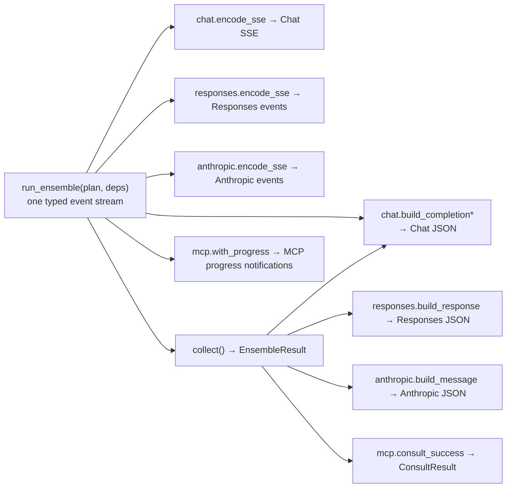

# MoM v2 Architecture

MoM (Mixture of Models) is an OpenAI/Anthropic-compatible gateway. A single request fans out to a
panel of models, then a synthesizer consolidates their perspectives into one answer. The gateway
speaks three wire protocols on the way in (OpenAI Chat Completions, OpenAI Responses, Anthropic
Messages) and re-renders the same internal result into whichever one the caller used.

This document explains how the codebase is organized and why. The single most important idea is in
the first section; everything else follows from it.

---

## The load-bearing idea: streaming is a property of the renderer, not the engine

There is exactly **one** orchestration path. `run_ensemble` (in `src/mom/engine/pipeline.py`) runs
the whole request — fan-out, synthesis, cost, metrics — and emits a **typed event stream**
(`AsyncIterator[StreamEvent]`). It does not know about SSE, JSON, OpenAI, or Anthropic. It never
raises: an upstream failure becomes a terminal `PipelineFailed` event.

Everything a client sees is produced by folding that one event stream:



- **Streaming responses** are the encoders' `encode_sse` async generators consuming the live event
  stream and yielding protocol bytes.
- **Non-streaming responses** call `collect()` (also in `pipeline.py`), which drains the *same*
  event stream into a single `EnsembleResult`, then a `build_*` function renders that struct.

Because there is no second code path, the streaming and non-streaming views of a request cannot
drift. And because the event stream is a closed, typed union (`StreamEvent` in
`src/mom/domain/events.py`), adding a new event variant makes `mypy --strict` fail on every
`match`/`if isinstance` chain in every encoder that does not handle it. Wire-format consistency is
therefore a compile-time property, not a test we hope covers every case.

The event vocabulary is small and provider-neutral:

| Event | Meaning |
| --- | --- |
| `FanoutStarted(identity, model)` | a member call is about to run |
| `MemberCompleted(outcome)` | a member finished (carries a `ModelOutcome`: content, usage, cost, status) |
| `FanoutSkipped(reason)` | fan-out was bypassed (`passthrough` or `tool_continuation`) |
| `SynthesisStarted(llm, model)` | the synthesizer stream is opening |
| `AnswerDelta(content?, reasoning?)` | a synthesizer text/reasoning delta |
| `ToolCallStarted(index, call_id, name)` | the synthesizer opened a tool call |
| `ToolCallDelta(index, arguments_fragment)` | streamed tool-argument JSON |
| `Completed(finish_reason, usage, total_cost_usd)` | terminal success (aggregate usage + cost) |
| `PipelineFailed(code, message, http_status)` | terminal failure (carries the HTTP status) |

`collect()` preserves failure fidelity: a `PipelineFailed` is re-raised as an `UpstreamError`
carrying the original `http_status`/`code`, so a non-streaming request fails with the same status a
streaming request would have surfaced.

---

## Hexagonal layering

The package `mom` (under `src/mom/`) is arranged so that the pure core knows nothing about I/O.
Dependencies point inward, toward the domain.

```
            cli ─────────────► api ─────────────► runtime
                                │                    │
                                ▼                    ▼ (composition root)
        ┌──────────────── engine ◄──── adapters ────┐  store
        │                   │            (litellm)   │  (aiosqlite)
        │                   ▼                        │
        │   config ────► domain  ◄── ports (Protocols)
        │  (catalog)   (pure: IR, events, results, cost, cachekey)
```

| Layer | Package | Responsibility |
| --- | --- | --- |
| **domain** | `mom.domain` | Pure value types and pure functions: the request IR, `StreamEvent`s, `Usage`/`ModelOutcome`/`EnsembleResult`, cost math, the cache-key algorithm, synthesis assembly, tool classification. No I/O, no framework imports. |
| **ports** | `mom.domain.ports` | The Protocols the engine depends on — `LLMClient`, `Clock`, `IdFactory`, `CacheStore`, `Tracer` — plus the `CallSpec`/`Completion`/`CompletionChunk` DTOs. Living in the domain inverts the dependency: the engine talks to abstractions, never to LiteLLM or aiosqlite. |
| **engine** | `mom.engine` | The orchestration: `resolve_plan` (request + catalog → `ExecutionPlan`) and `run_ensemble`/`collect`. Depends only on domain + ports. |
| **adapters** | `mom.adapters` | Port implementations that touch the outside world: `LiteLLMClient` (the provider transport), `CachingClient` (response cache middleware), the Langfuse tracer. |
| **config** | `mom.config` | The YAML schema (Pydantic v2), `extends` resolution, and the immutable `ResolvedCatalog` the app consumes; plus per-ensemble capability cards. |
| **store** | `mom.store` | Two aiosqlite databases: the response cache and the metrics store. |
| **api** | `mom.api` | FastAPI routers, wire schemas, the three encoders, the translate layer (wire → IR), and `mom.api.mcp` — the MCP tool surface, a sibling of the routers that folds the same event stream. |
| **runtime** | `mom.runtime` | Composition root: `Settings`, the `Container`, and `build_container` wiring. |
| **cli** | `mom.cli` | The `mom` Typer app (`serve`, `mcp`, `config validate/show`, `cache`, `metrics`, `healthcheck`). |

### Contracts that enforce it

`pyproject.toml`'s `[tool.importlinter]` pins two contracts, checked in CI:

1. **Layered architecture** (`type = layers`, `["mom.cli", "mom.api", "mom.runtime"]`) — a higher
   layer may import a lower one but not vice-versa: `runtime` cannot import `api`, and `api` cannot
   import `cli`. This is why the `Container` lives in `mom.runtime.container` (so the composition
   root builds it without `runtime` importing `api`) and `mom.api.deps` merely re-exports it.
2. **Domain is pure** (`type = forbidden`, source `mom.domain`) — the domain may not import `api`,
   `runtime`, `store`, `config`, or `cli`. The domain is a leaf.

A third, unwritten but real invariant is enforced by convention and a module docstring: **only
`mom.adapters.litellm_client` may import `litellm`** (see the adapter boundary below).

---

## Request lifecycle

Every endpoint follows the same five moves. Taking `POST /v1/chat/completions` as the example:

```
  wire request            translate            resolve                 fold
 ┌────────────┐  IR   ┌──────────────┐  plan  ┌──────────────┐ events ┌──────────┐
 │ Chat/Resp/ │─────► │ ChatRequestIR│ ─────► │ ExecutionPlan│ ─────► │ encoder  │──► SSE / JSON
 │ Anthropic  │       │ (canonical)  │        │              │        │  (fold)  │
 └────────────┘       └──────────────┘        └──────────────┘        └──────────┘
                       translate_*.py           resolve_plan          encoders/*.py
                                                      │
                                                      ▼
                                          run_ensemble(plan, deps)
                                   fan-out ─► synthesize ─► Completed
```

1. **Wire → IR.** The router validates the request with a Pydantic schema (`extra="ignore"`, so
   unknown fields are dropped, not rejected), then a `translate_*` module maps it into the single
   canonical `ChatRequestIR` (`src/mom/domain/request.py`). All three protocols converge here, so
   the engine never sees a wire shape. The IR is deliberately OpenAI-chat-shaped because that is
   LiteLLM's lingua franca.

2. **Resolve the plan.** `resolve_plan(catalog, ir)` turns the request plus the resolved config
   into an `ExecutionPlan` *before any streaming starts*. Unknown models (`UnknownModelError`, 404)
   and invalid effort values (`InvalidRequestError`, 400) fail here — cleanly, as HTTP errors,
   instead of mid-stream after fan-out money is already spent. Resolution also:
   - resolves the client's requested effort to a defined **tier** via `nearest_tier` (ties round up
     toward quality), or `default_tier` when none is requested;
   - computes each member's provider params (its configured `params`, plus the effort token for the
     tier, plus web-search params when requested), and applies the **client's sampling** to the
     *synthesizer* (see "Sampling" note below);
   - filters image requests to vision-capable members;
   - decides `skip_fanout` — a `passthrough` ensemble or a tool-continuation **relay** turn (the tail
     of the conversation is tool results) goes straight to the synthesizer;
   - attaches per-member `Pricing` (from config) for cost, and plans provider prompt-caching.

3. **Fan out.** `run_ensemble` starts one task per member, gated by an `asyncio.Semaphore` so at
   most `max_concurrency` members call upstream at once (default cap **16**, so an unset config can
   never open an unbounded number of connections). Two independent deadlines protect the request:
   - **Per-call:** each member is wrapped in `asyncio.wait_for(client.complete(spec), timeout=…)`;
     a timeout yields a `timeout` outcome, not an exception.
   - **Overall:** an optional wall-clock `fanout_deadline`. The loop uses
     `asyncio.wait(..., return_when=FIRST_COMPLETED)`; if the deadline elapses with nothing new, it
     abandons the stragglers.
   - **Cancel path:** a `finally` block cancels every task that has not finished — on deadline, on
     client disconnect, or on any error — so no member call outlives the request.

   Each completed member is emitted as a `MemberCompleted` event, recorded to metrics, and traced.

4. **Synthesize (streaming).** Successful member outputs are assembled into the synthesizer's
   messages (`build_synthesis_messages`: client history, then a candidate block, then the synthesis
   prompt — an order that keeps the stable history a cacheable prefix). If every member failed, an
   `all_failed_message` asks the synthesizer for a brief apology instead. The synthesizer is always
   called via `client.stream(...)`, wrapped in `_stream_with_timeout` (which guards only the wait
   for the *next* chunk, so a healthy stream is never interrupted mid-flight). Its deltas become
   `AnswerDelta` / `ToolCallStarted` / `ToolCallDelta` events; the final `Completed` carries the
   **aggregate** usage (synth + all members) and total cost.

5. **Render.** The router hands the event iterator to the protocol's encoder — `encode_sse` for a
   streaming response, or `collect()` + `build_*` for JSON.

### What this looks like in the logs

Each of those milestones also emits one `INFO` log line, bound to the request's id and ensemble, so
`docker logs` narrates a live request without a debug flag: the fan-out roster, a `member
dispatched` line as each call leaves (logged inside the concurrency semaphore, so a panel wider than
`max_concurrency` shows its stagger), a `member completed` line as each lands, `synthesis started`,
and a closing `run completed` with totals and elapsed time. Because they are emitted here rather
than in the routers, all three surfaces and both render modes narrate identically.

These lines carry the same coarse shape as the `ProgressEvent`s published alongside them, minus
`preview` — the dashboard's previews are truncated model output, which belongs on an ephemeral,
same-origin bus and not in a durable log. See [Reading the
logs](CONFIGURATION.md#reading-the-logs).

### Sampling note

Client generation controls (`temperature`, `top_p`, `max_tokens`, `stop`, `seed`) are applied to
the **synthesizer only** — it produces the client-visible output. Advisory members keep their own
tuned params, so a client `max_tokens` never truncates a member's internal reasoning. Client-sent
values win over the synthesizer's configured defaults; honoring them is the whole point (v1 dropped
them silently).

---

## The provider adapter boundary

`src/mom/adapters/litellm_client.py` is the **only** module that imports `litellm`. Everything
above it works in the domain's neutral types (`CallSpec` in, `Completion`/`CompletionChunk` out), so
the provider SDK is fully quarantined. The adapter's jobs:

- **Two APIs.** `complete`/`stream` route to `litellm.acompletion` for `api: chat` models, or to
  `litellm.aresponses` for `api: responses` models. Both are normalized to the same `Completion` /
  `CompletionChunk` shapes, so the engine cannot tell which upstream API was used.
- **Usage normalization.** `_usage` reads token counts across the many spellings providers use for
  cache-read / cache-write tokens (OpenAI `prompt_tokens_details.cached_tokens`, Anthropic top-level
  `cache_read_input_tokens` / `cache_creation_input_tokens`, DeepSeek `prompt_cache_hit_tokens`,
  Bedrock camelCase…), so cache-aware cost is never undercounted.
- **Cost.** `_response_cost` prefers the **real** cost the provider returned (OpenRouter usage
  accounting / litellm `response_cost`), then falls back to `litellm.completion_cost`, then to
  `cost_per_token` over the final usage. For OpenRouter models it sets `extra_body.usage.include`
  so the upstream returns priced usage.
- **Effort clamping.** litellm maps `reasoning_effort` onto each provider's native reasoning param,
  but the *value* must be one the provider accepts. `_normalize_reasoning_effort` clamps MoM's
  extended ladder to what works: OpenAI/Azure keep `minimal…high`; other providers map `minimal→low`
  and cap at `high`; `xhigh`/`max` collapse to `high`; `none` drops the param entirely. Combined
  with `drop_params=True`, this replaces the raw passthrough that made Gemini/Anthropic 400 on an
  unsupported effort value.
- **Proxy, no silent fallback.** A model with a configured `proxy_url_env` is routed through a
  request-scoped httpx client (`trust_env=False`, so ambient proxy env is ignored). If the proxy is
  configured but its env var is unset or malformed, the call **raises** rather than connecting
  directly — a proxied model never silently leaks onto a direct connection.
- **Safety.** Raw provider exception text never propagates; failures become a generic
  `UpstreamError`, and the operator sees the detail only in logs.

`LITELLM_LOCAL_MODEL_COST_MAP=True` is set in `mom/__init__.py` — the one place guaranteed to run
before anything can import litellm — so the cost map is read from litellm's bundled catalog
instead of fetched over the network at import time.

That makes the pinned litellm version a *model-catalog* dependency, not just an API one. litellm
reads three things out of that catalog, and a model with no entry loses all three at once: output
sizing (Anthropic requires `max_tokens`, so litellm substitutes 4096 — a thinking model spends
that budget before writing prose and returns empty), whether the model still accepts
`temperature`/`top_p` (a catalog flag, consulted for OpenAI and Anthropic alike), and price
(no cost-per-token means the call records at $0).

Two checks cover this, at the two points where each is knowable:

- **Startup** — `build_container` reports configured models with no exact catalog entry, grouped
  by provider. Anthropic gaps are a warning (predictably fatal); the rest are info, since their
  only consequence is a $0 price and most are covered by the provider reporting its own cost.
- **First call** — `_warn_once_if_free` warns, once per model, when a real call burns tokens and
  still prices at $0. Whether a provider self-reports cost is a runtime fact no config can state
  (OpenRouter does, Gemini and xAI do not), so this names the models that really are free rather
  than the ones that might be.

Fix by raising the litellm floor in `pyproject.toml`, or by declaring `pricing:` for a model the
upstream catalog does not carry at all. `LITELLM_LOCAL_MODEL_COST_MAP=False` forces the network
fetch as a stopgap.

---

## The data layer

Two SQLite databases live side-by-side under one `data_dir` (resolved from `MOM_DATA_DIR`, then the
config's `storage.data_dir`, then a platform default): `cache.db` and `metrics.db`. Both are opened
through `src/mom/store/connection.py`, which applies the same PRAGMAs and a `user_version`-based
migration list (no ORM, no Alembic):

```
PRAGMA journal_mode = WAL          -- readers never block the writer
PRAGMA synchronous  = NORMAL       -- durable enough for a cache/metrics store, much faster
PRAGMA busy_timeout = 5000         -- wait up to 5s rather than erroring on a locked db
PRAGMA foreign_keys = ON
PRAGMA temp_store   = MEMORY
```

Each database is one long-lived aiosqlite connection; aiosqlite runs it on a dedicated worker
thread, so writes serialize naturally and never block the event loop.

- **Response cache** (`store/cache.py`, wired as `CachingClient` middleware). Caches **non-streaming
  member completions only** — the synthesizer stream is never cached. Keyed by the bit-compatible
  `cache_key` (below). A hit costs $0 and is marked `cached=True` so the pipeline records it as a
  cache hit. Tool-call, empty, and `length`-truncated results are deliberately **not** cached.
  Eviction is exact and synchronous inside the write transaction: a TTL check on read, and an
  LRU-by-`last_used_at` size-cap sweep on write (no background scanner).
- **Metrics** (`store/metrics.py`). One STRICT `llm_calls` table. Writes go through
  `MetricsRecorder` — a bounded `asyncio.Queue` (maxsize 1000) drained by a single background worker
  in batches — so a slow disk can **never backpressure token streaming**. On overflow a row is
  dropped and a counter is bumped; the row is written **off the request path**. The schema records
  provider cache tokens and a `turn_type` (`ensemble` vs relay `continuation`) so the relay
  cost-savings are queryable. `GET /v1/metrics/usage` reads a single-pass aggregate from this table.

### The cache key

`src/mom/domain/cachekey.py` is a crown-jewel function: its SHA256 output is the cache's primary
key, so any change silently invalidates every entry and re-spends against paid providers. It is a
**bit-compatible** port of the v1 algorithm (pinned by a golden test): canonical JSON over
`{llm_name, model, messages, params}`, with sensitive keys dropped, runtime/volatile params
(`api_key`, `timeout`, `num_retries`) ignored, and volatile S3 presigned-URL query params stripped.
The one intentional v2 change — excluding `stream`/`stream_options` so streaming and non-streaming
share an entry — happens at the call site, keeping this module bit-identical to v1.

---

## Cost model

Cost is computed cache-aware and pure (`src/mom/domain/cost.py`), from token `Usage` and per-model
`Pricing` (per-1M-token rates). Cached prompt tokens bill at the cache-read rate, cache-write tokens
add at the cache-write rate, and the remaining prompt bills at the full input rate.

Where the number comes from, per call, in priority order (`pipeline.py::_run_member` and the
synthesis path):

1. **Cache hit → $0.**
2. **Config pricing wins.** If the LLM has a `pricing:` block, `compute_cost(usage, pricing)` is
   authoritative — this is how you price a model litellm's map does not know, or override a wrong
   rate.
3. **Otherwise the adapter's cost.** The real provider-returned cost (OpenRouter) or litellm's cost
   map, as computed in the adapter.

The `Completed` event's `total_cost_usd` sums every member plus the synthesizer.

### Provider prompt caching

Separate from MoM's own response cache, `resolve_plan` also plans **provider-side** prompt caching
for the synthesizer (a cost lever, always safe — a target that does not support it ignores it):

- **Anthropic family:** `cache_control` breakpoints are injected into the synthesizer's messages at
  stream time (`inject_anthropic_cache`), marking the stable system prompt and the end of stable
  history (max 4 breakpoints), with a 5m or 1h TTL.
- **OpenAI / Azure / xAI:** a stable `prompt_cache_key` (a hash of the leading, non-volatile
  messages) is added for prefix-cache routing affinity — no server-side state is held.

---

## Streaming timeline (Chat SSE)

The order of frames for a `stream: true` Chat Completions request, showing how the encoder folds
the event stream. Frames in **bold** appear only when `show_work: inline`; the `usage` frame appears
only when `stream_options.include_usage` is set.

```
engine event               →  Chat SSE frame(s) emitted by chat.encode_sse
──────────────────────────────────────────────────────────────────────────
FanoutStarted × N          →  (ignored)
MemberCompleted × N        →  (ignored, unless show_work: inline)
  └─ show_work: inline      → data: {"delta":{"role":"assistant","content":""}}
                             data: {"delta":{"content":"<think>\n"}}
                             data: {"delta":{"content":"Model: …\nContent: …\n---\n"}}   (per member)
SynthesisStarted           →  data: {"delta":{"content":"</think>\n\n"}}                 (closes think block)
AnswerDelta (first)        →  data: {"delta":{"role":"assistant","content":""}}          (role sent once)
AnswerDelta (reasoning)    →  data: {"delta":{"reasoning_content":"…"}}
AnswerDelta (content) × M  →  data: {"delta":{"content":"…"}}
ToolCallStarted            →  data: {"delta":{"tool_calls":[{index,id,type,function:{name}}]}}
ToolCallDelta × K          →  data: {"delta":{"tool_calls":[{index,function:{arguments}}]}}
Completed                  →  data: {"delta":{},"finish_reason":"stop"}
  └─ include_usage          → data: {"choices":[],"usage":{…aggregate…}}
                             data: [DONE]
PipelineFailed             →  data: {"error":{message,type:"upstream_error",code}}
                             data: [DONE]
```

Invariants the encoder guarantees: the assistant `role` is sent exactly once (on the first delta); a
terminal `finish_reason` frame is always emitted (synthesized as `stop` if the provider omits one);
and `[DONE]` is always the last line. The Responses and Anthropic encoders fold the identical event
stream into their own event grammars (`response.*` items with a centralized `sequence_number`;
`message_start` / `content_block_*` / `message_delta` / `message_stop`) — same source, no drift.

---

## Composition and configuration

- **`discovery`** (`mom.runtime.discovery`) resolves the config *search path* — a user level
  (`~/.mom`, `$XDG_CONFIG_HOME/mom`) under a project level (`./mom.yaml`, `./.mom/config.yaml`),
  each with a sibling override — into an ordered list of files. It is pure: `cwd`, `home` and the
  XDG root are parameters, not global reads, so the search path is testable against a synthetic
  tree. `--config`/`MOM_CONFIG` turns it off and pins one file.
- **`secrets`** (`mom.runtime.secrets`) reads the `.env` / `auth.json` files on that same path.
  Provider keys go into `os.environ` (`litellm_client` dereferences them by name at call time, so
  there is no object to thread them through); `MOM_*` names deliberately do not, reaching
  `Settings` through its dotenv source instead. Warnings are returned as data, never logged in
  place — `mom mcp` writes JSON-RPC on stdout, where a stray log line is a protocol violation.
- **`bootstrap`** (`mom.runtime.bootstrap`) is the single resolver every entry point calls, so
  `mom serve`, `mom mcp`, `mom config`, `mom cache` and `mom metrics` cannot disagree about which
  files are in play.
- **`Settings`** (`mom.runtime.settings`) reads only machine-local facts and secrets from `MOM_`-
  prefixed env vars (`MOM_CONFIG`, `MOM_API_TOKEN`, `MOM_DATA_DIR`, …), with legacy v1 aliases
  accepted. It never carries the YAML model config.
- **`build_container`** (`mom.runtime.wiring`) is the composition root: it takes an
  already-resolved `ResolvedCatalog`, opens the two stores, wraps the `LiteLLMClient` in the
  `CachingClient` when caching is enabled, builds the tracer, and returns a frozen `Container` plus
  an async cleanup. `create_app` (`mom.api.app`) wires this into FastAPI's lifespan and installs the
  routers, CORS (from the catalog it is handed), and the `MomError → OpenAI-shaped-JSON` exception
  handlers. `serve_app` is the factory `mom serve` points uvicorn at: it bootstraps once, in the
  process that will serve — the child, under `--reload`.
- Building the app has **no import-time side effects** and reads **no files**: everything
  `create_app` knows about the config is passed to it. Tests inject a prebuilt `Container` (with
  fakes) and skip the lifespan entirely.

See [CONFIGURATION.md](CONFIGURATION.md) for the config schema and [API.md](API.md) for the endpoint
reference.
