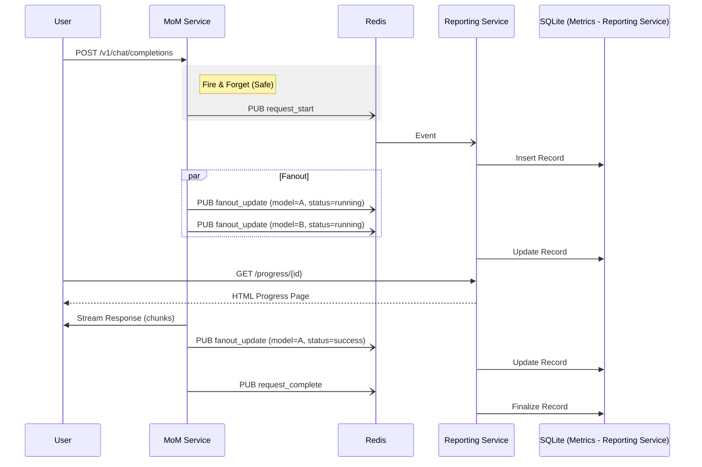

# Implementation Plan: MoM Progress Reporting Service

This plan details the steps to separate the reporting and progress tracking logic into a standalone microservice that consumes events from Redis.

## Architecture Overview

1.  **MoM Service (Producer)**:
    *   Publishes events to Redis (channels: `mom_events`).
    *   Events include: `request_start`, `fanout_start`, `fanout_complete`, `concluding_start`, `concluding_complete`, `request_complete`, `error`.
    *   Includes a link to the progress page in the HTTP response headers and/or thinking blocks.
    *   **Crucial**: Redis usage is strictly optional. If Redis is not configured or fails, the service proceeds without error (fire-and-forget).

2.  **Redis**:
    *   Message broker for decoupling services.
    *   Lean solution: Standard Redis is very lightweight. We will use a standard `redis` image.

3.  **Reporting Service (Consumer)**:
    *   Subscribes to Redis channels.
    *   Maintains state of active requests (in-memory or local DB).
    *   Exposes HTTP endpoints:
        *   `/progress/{request_id}`: HTML page for progress visualization.
        *   `/v1/metrics`: Moved from the main service.
    *   **Ownership**: All usage tracking logic (DB writes) is moved here.

## Step-by-Step Implementation

### Phase 1: Infrastructure & Configuration

1.  **Update `docker-compose.yml`**:
    *   Add `redis` service (standard `redis:alpine`).
    *   Add `mom-reporting` service (build context same as main, different command).
    *   Update `mom-service` to optionally link to `redis`.

2.  **Update Configuration**:
    *   Add Redis connection details to `config.yaml` / `.env` (`REDIS_URL`).
    *   Add `REPORTING_SERVICE_URL` to config for generating links.
    *   Add `ENABLE_REDIS` flag (defaulting to false if not set).

### Phase 2: MoM Service Modifications (Producer)

3.  **Redis Publisher**:
    *   Create `mom_service/events.py`:
        *   `RedisPublisher` class (async).
        *   **Resiliency**: Wrap all publish calls in try/except to ensure failures are logged but don't crash the request.
        *   Event schemas (Pydantic models).

4.  **Inject Instrumentation**:
    *   Modify `mom_service/main.py`:
        *   Initialize `RedisPublisher` on startup (if enabled).
        *   Emit `request_start` and `request_complete` events.
    *   Modify `mom_service/core_logic.py`:
        *   Inject publisher into `_perform_fanout_calls` and `_execute_concluding_call`.
        *   Emit fine-grained events.

### Phase 3: Reporting Service (Consumer)

5.  **Service Skeleton**:
    *   Create `mom_service/reporting/` directory.
    *   Create `mom_service/reporting/main.py`:
        *   FastAPI app setup.
        *   Startup event: connect to Redis and start subscriber task.

6.  **Event Consumer & Metrics Migration**:
    *   Implement logic to listen to `mom_events` channel.
    *   **Move DB Logic**: Move `metrics_db.py` logic to the reporting service. The main service should no longer write to SQLite.
    *   Update local state (DB) based on events.
    *   *Note*: Since main service no longer writes to DB, `metrics_db.py` in main service might become read-only or be removed/stubbed.

7.  **Progress UI**:
    *   Create `mom_service/reporting/templates/progress.html`.
    *   Endpoint `/progress/{request_id}`.
    *   Use HTMX or simple polling JS.

8.  **Metrics API Migration**:
    *   Move `metrics_api.py` logic to `mom_service/reporting/metrics_api.py`.
    *   Ensure the reporting service now owns the `usage_metrics.db`.

### Phase 4: Integration & Cleanup

9.  **Links & Headers**:
    *   Update `mom_service/main.py` to add `X-MoM-Progress-Url` header.
    *   Optionally add a "Check progress here: ..." message in the thinking block if streaming.

10. **Testing**:
    *   Verify events flow from MoM -> Redis -> Reporting.
    *   Verify UI updates in real-time.
    *   Verify metrics are still recorded correctly.
    *   **Verify graceful degradation**: Kill Redis container and ensure MoM service still works (just no reporting).

## Mermaid Diagram

